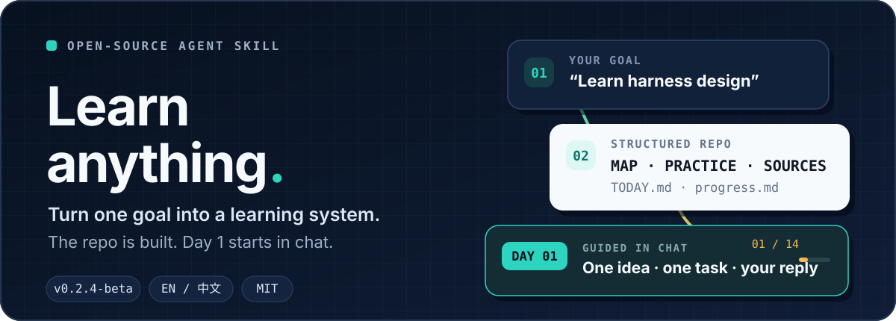
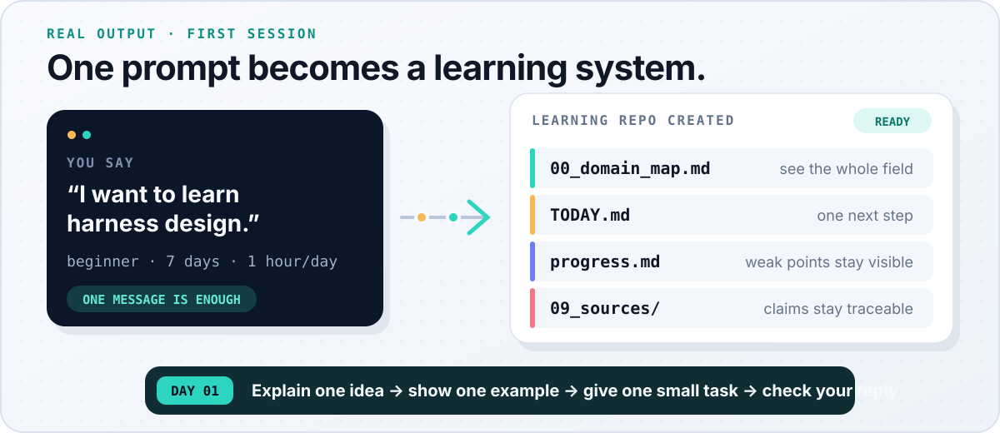
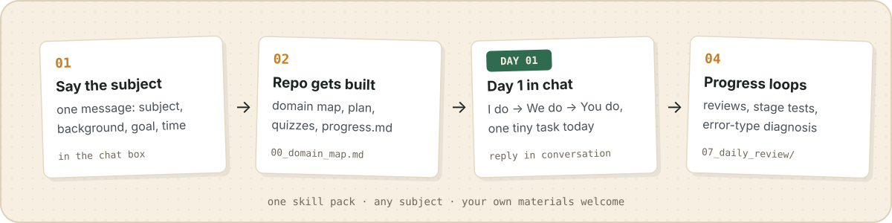

<p align="right">
  <strong>English</strong> · <a href="./README.zh-CN.md">简体中文</a>
</p>

<p align="center">
  
</p>

<p align="center">
  <a href="#start-in-two-minutes"><strong>Quick start</strong></a> ·
  <a href="#see-the-system-take-shape">See it work</a> ·
  <a href="./examples/en-US/learn-ai-agent/">Example repo</a> ·
  <a href="./docs/user-guide.md">User guide</a> ·
  <a href="./RELEASE_NOTES.md">v0.2.4-beta</a>
</p>

**Learn Anything** is an open-source Agent Skill Pack for learning any subject with an AI agent. It creates a durable learning repository, starts teaching immediately in the conversation, and keeps the next lesson tied to your real progress.

## See the system take shape

<p align="center">
  
</p>

Tell the agent what you want to learn, your background, your goal, and your available time:

```text
Use learn-anything to create a learning project for "harness design".
My background: complete beginner.
Goal: understand the basics in 7 days and apply them to my content workflow.
Daily time: 1 hour.
```

The agent then:

- creates a domain map, lessons, exercises, quizzes, a final project, and source records;
- writes `START_HERE.md` and `TODAY.md` so the next step is obvious;
- starts Day 1 in the chat with one explanation, one example, and one small task;
- checks your reply before updating `progress.md` and the next session.

See a [complete Day 1 transcript](./examples/en-US/guided-learning-session.md) or browse a [generated AI Agent learning repository](./examples/en-US/learn-ai-agent/).

If you only want the files, add `scaffold only` or `generate files only`.

### Guided Learning Mode

You do not need to open the generated files first. Unless you ask for scaffold-only output, Day 1 starts immediately in the chat with a plain-language idea, a worked example, a small task, a copyable answer template, and a clear way to check your answer.

## Start in two minutes

### 1. Put the Skill where your agent can read it

```bash
git clone https://github.com/vesperchinn/learn-anything-skill.git
cd learn-anything-skill
```

Open this directory in Codex, Claude Code, Cursor, Trae, or another file-capable agent. If your agent supports Skills directly, import this repository or place it in its Skills directory.

### 2. Ask for your first learning project

```text
Use learn-anything to create a learning project for "Python".
My background: beginner.
My goal: build a small automation in 14 days.
Daily time: 45 minutes.
```

Already have PDFs, slides, notes, or course material? Use:

```text
Use learn-anything to create a learning project from my materials.
Prioritize the provided materials and mark anything that still needs verification.
```

### 3. Continue from your saved progress

```text
Continue with learn-anything. Read my progress and run today's learning session.
```

The command-line scaffold is also available:

```bash
./scripts/new-domain.sh "Your Subject" en-US
```

See the [quick-start guide](./docs/quick-start.md) for more installation paths and fallback instructions.

## Why the learning keeps moving

<p align="center">
  
</p>

New learners get a guided **I do → We do → You do** lesson instead of a long lecture. Every session has a concrete task and a visible completion standard. Stage tests revisit weak points, while `progress.md` and `progress-log.md` keep the learning state outside a disposable chat.

| A one-off AI chat | Learn Anything |
| --- | --- |
| Explains a topic once | Builds a learning path you can resume |
| Gives information before practice | Teaches, demonstrates, then asks you to try |
| Forgets weak points between chats | Tracks progress, errors, and next steps in files |
| Can sound certain without evidence | Records sources, freshness, and claims to verify |

The method combines five systems: a **knowledge map**, **glossary**, **exercises**, a **final project**, and **review loops**. The rationale lives in [learning principles](./references/en-US/learning-principles.md).

## Learn from your own materials

The material-grounded path works with PDFs, slides, Markdown, notes, manuals, and webpage exports.

- Your materials remain the primary source for the learning plan.
- Outside knowledge is labeled `Supplemental` instead of being blended in silently.
- `material_coverage_map.md` shows what is grounded, partial, or missing.
- Unreadable charts, screenshots, and tables are recorded in `learning_materials/extraction_issues.md` instead of guessed.

Keep confidential documents, personal data, paid course materials, and copyrighted books out of public learning repositories unless you have permission to store and transform them.

## Reliability is part of the system

- **Source first:** no fabricated URLs, papers, dates, or benchmarks.
- **No source, no claim:** unsupported material is marked `[unverified]` or moved to `09_sources/claims_to_verify.md`.
- **Freshness visible:** every module records stability risk and a recommended review interval.
- **Safe fallback:** without web access, the output is labeled **Unverified Draft** and includes a verification checklist.
- **High-stakes caution:** medical, legal, financial, safety, cybersecurity, and certification topics require an educational-use notice and authoritative sources.

This reduces hallucination risk; it does not guarantee absolute correctness.

### Freshness Notice

When a learning repository is created, the chat includes a short **Freshness Notice** before Day 1. It shows the highest freshness risk, the recommended review interval, and where to find `09_sources/freshness_log.md`; fast-changing or high-risk projects also point to `09_sources/claims_to_verify.md`.

## Multi-Platform Support

| Setup | Examples | What to use |
| --- | --- | --- |
| File-based agent / native Skill | Codex, Claude Code, Cursor, Trae | Repository root `SKILL.md` plus the included prompts, templates, and references |
| Platform or knowledge-base workflow | Coze, WorkBuddy, CodeBuddy | Packages and platform notes under [`platforms/`](./platforms/) |
| Chat-only agent | ChatGPT or any text-only assistant | Copyable prompts and path-labeled Markdown output |

File access, web access, workflow support, and persistence differ by platform. Low-code adapters are experimental in this beta; review the [capability matrix](./platforms/capability-matrix.md) before relying on one.

English (`en-US`) and Simplified Chinese (`zh-CN`) are complete. Interface language and learning-material language can be set independently.

## Inside the repository

```text
learn-anything-skill/
├── SKILL.md        # Agent entry point and routing rules
├── core/           # Core prompts and learning protocols
├── templates/      # Complete learning-repository templates
├── examples/       # Generated repositories and session transcripts
├── prompts/        # Material-grounded learning workflows
├── references/     # Learning and reliability methods
├── adapters/       # Agent-specific setup guides
├── platforms/      # Low-code and knowledge-base adapters
├── scripts/        # Scaffolding and validation tools
├── evals/          # Behavior checks
└── harness/        # Read-only maintenance and release checks
```

### Documentation

- [Quick start](./docs/quick-start.md) · [User guide](./docs/user-guide.md)
- [Release notes](./RELEASE_NOTES.md) · [Roadmap](./ROADMAP.md) · [Changelog](./CHANGELOG.md)
- Agent guides: [Codex](./adapters/codex.md) · [Claude Code](./adapters/claude-code.md) · [Cursor](./adapters/cursor.md) · [ChatGPT](./adapters/chatgpt.md) · [Generic](./adapters/generic-agent.md)

## Maintenance Harness and contributing

Run the repository's read-only release checks with:

```bash
python3 harness/scripts/run_all_checks.py --root . --report
```

Contributions are welcome: new adapters, templates, examples, tests, and prompt improvements. Read [CONTRIBUTING.md](./CONTRIBUTING.md) before opening a change.

Inspired by [@GeekCatX](https://x.com/GeekCatX)'s article about using Codex to learn a new field quickly.

## Start a new subject

```text
Use learn-anything to create a learning project for "the subject I want to learn".
```

## License

MIT © 2026 Learn Anything Skill Pack Contributors
