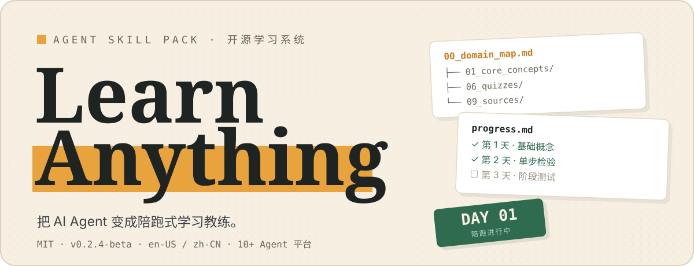
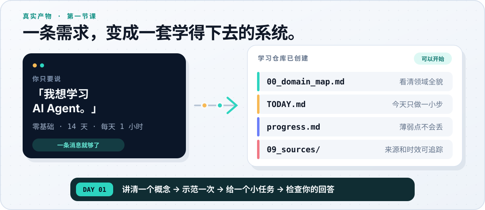
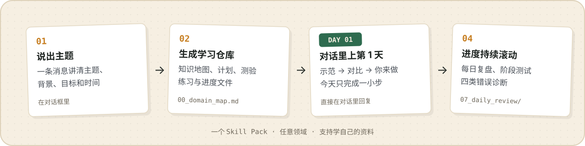

<p align="right">
  <a href="./README.md">English</a> · <strong>简体中文</strong>
</p>

<p align="center">
  
</p>

<p align="center">
  <a href="#两分钟开始"><strong>快速开始</strong></a> ·
  <a href="#看看它怎样工作">看看效果</a> ·
  <a href="./examples/zh-CN/learn-ai-agent/">示例仓库</a> ·
  <a href="./docs/user-guide.zh-CN.md">使用指南</a> ·
  <a href="./RELEASE_NOTES.md">v0.2.4-beta</a>
</p>

<p align="center">
  <a href="https://github.com/vesperchinn/learn-anything-skill/actions/workflows/ci.yml"></a>
</p>

**Learn Anything** 是一套开源 Agent Skill Pack，帮助你用 AI Agent 学习任意领域。它会建立一套可持续使用的学习仓库，立刻在对话里开始教学，并让下一节课始终基于你的真实进度。

## 看看它怎样工作

<p align="center">
  
</p>

告诉 Agent 你想学什么、当前基础、目标和可用时间：

```text
使用 learn-anything，帮我为「AI Agent」创建一个中文学习项目。
我的背景：完全零基础。
我的目标：14 天后理解基本原理，并做出一个小项目。
每天可学习：1 小时。
```

Agent 随后会：

- 创建领域地图、课程、练习、测验、最终项目和来源记录；
- 写好 `START_HERE.md` 和 `TODAY.md`，让下一步始终清楚；
- 直接在对话里开始第 1 天，用一个解释、一个示范和一个小任务带你入门；
- 检查你的回答，再更新 `progress.md` 和下一节课。

可以查看[完整的第 1 天对话](./examples/zh-CN/guided-learning-session.md)，或浏览一套[已经生成的 AI Agent 学习仓库](./examples/zh-CN/learn-ai-agent/)。

如果只想生成文件，加上「只创建项目」「不要开始学习」或 `scaffold only`。

### 陪跑学习模式

你不用先打开生成的文件。除非明确要求只创建项目，否则第 1 天会立即在对话里开始：先讲清一个概念，再给完整示范、一个小任务、可复制的作答模板和清楚的检查标准。

## 两分钟开始

### 1. 把 Skill 放到 Agent 能读取的位置

```bash
git clone https://github.com/vesperchinn/learn-anything-skill.git
cd learn-anything-skill
```

用 Codex、Claude Code、Cursor、Trae 或其他能读写文件的 Agent 打开这个目录。Agent 如果原生支持 Skills，也可以直接导入整个仓库，或放进它的 Skills 目录。

### 2. 创建第一个学习项目

```text
使用 learn-anything，帮我为「Python」创建一个中文学习项目。
我的背景：零基础。
我的目标：14 天后做出一个小型自动化工具。
每天可学习：45 分钟。
```

已经有 PDF、PPT、笔记或课程资料，可以这样说：

```text
使用 learn-anything，基于我提供的资料创建一个学习项目。
请优先引用资料内容，并标记哪些内容还需要核实。
```

### 3. 从保存的进度继续

```text
继续使用 learn-anything。读取我的进度，开始今天的学习。
```

也可以用命令行快速生成仓库：

```bash
./scripts/new-domain.sh "你的主题" zh-CN
```

更多安装方式和降级方案见[快速开始指南](./docs/quick-start.zh-CN.md)。

## 为什么它能持续陪你学下去

<p align="center">
  
</p>

零基础学习者会进入「**我先示范 → 一起对比 → 你来做**」的陪跑课程，而不是面对一篇长篇讲义。每节课都有具体任务和清楚的完成标准；阶段测试会重新检查薄弱点，`progress.md` 与 `progress-log.md` 则把学习状态保存在一次性对话之外。

| 普通的一次性 AI 对话 | Learn Anything |
| --- | --- |
| 把一个主题讲一遍 | 建立一条可以继续的学习路径 |
| 先给很多信息，再让你自己消化 | 先讲清、再示范、最后让你动手 |
| 换个对话就忘了薄弱点 | 用文件持续记录进度、错误和下一步 |
| 没有来源也可能说得很肯定 | 记录来源、时效和待核实主张 |

整套方法由五个系统组成：**知识地图、术语表、练习、最终项目和复盘闭环**。设计依据见[学习原则](./references/zh-CN/learning-principles.md)。

## 用自己的资料来学

资料学习模式支持 PDF、PPT、Markdown、笔记、手册和网页导出。

- 你的资料始终是学习计划的主要来源。
- 外部补充知识会标记为 `Supplemental`，不会悄悄混进原资料。
- `material_coverage_map.md` 会说明哪些内容完全基于资料、部分基于资料或仍然缺失。
- 无法读取的图表、截图和表格会记入 `learning_materials/extraction_issues.md`，不会凭空猜测。

公司机密、个人数据、付费课程资料和受版权保护的书籍，不应放进公开学习仓库，除非你有权保存和处理这些内容。

## 可靠性也是学习系统的一部分

- **来源优先**：不得编造 URL、论文、日期或 benchmark。
- **无来源、不主张**：没有依据的内容标记为 `[unverified]`，或移入 `09_sources/claims_to_verify.md`。
- **时效可见**：每个模块都记录稳定性风险和建议复查周期。
- **无网降级**：不能联网时，输出会标明「未验证草稿」，并附上核实清单。
- **高风险领域谨慎处理**：医疗、法律、金融、安全、网络安全和认证类主题，需要教育用途声明和权威来源。

这些机制能降低幻觉风险，但不能保证绝对正确。

### 时效性提醒（Freshness Notice）

创建学习仓库时，对话里会在第 1 天课程之前显示一段简短的时效性提醒，说明最高时效风险、建议复查周期和 `09_sources/freshness_log.md` 的位置；快速变化或高风险项目还会指向 `09_sources/claims_to_verify.md`。

## 国产 Agent 平台适配与多平台支持

| 使用方式 | 代表产品 | 接入方式 |
| --- | --- | --- |
| 文件型 Agent / 原生 Skill | Codex、Claude Code、Cursor、Trae | 使用仓库根目录的 `SKILL.md`、提示词、模板和参考资料 |
| 平台或知识库工作流 | Coze、WorkBuddy、CodeBuddy | 使用 [`platforms/`](./platforms/) 下的平台包和接入说明 |
| 纯聊天 Agent | ChatGPT 或其他文本助手 | 使用可复制提示词和带路径的 Markdown 输出 |

不同平台的文件访问、联网、Workflow 和记忆能力并不相同。低代码平台适配在当前 beta 中仍属实验功能，使用前请查看[能力矩阵](./platforms/capability-matrix.md)。

英文（`en-US`）和简体中文（`zh-CN`）已经完整支持；对话语言与学习资料语言可以分别设置。

## 仓库里有什么

```text
learn-anything-skill/
├── SKILL.md        # Agent 入口和路由规则
├── core/           # 核心提示词和学习协议
├── templates/      # 完整学习仓库模板
├── examples/       # 已生成仓库与对话示例
├── prompts/        # 基于自有资料的学习流程
├── references/     # 学习方法和可靠性规范
├── adapters/       # 不同 Agent 的接入指南
├── platforms/      # 低代码和知识库平台适配
├── scripts/        # 创建与检查工具
├── evals/          # 行为检查
└── harness/        # 只读维护与发布检查
```

### 文档

- [快速开始](./docs/quick-start.zh-CN.md) · [使用指南](./docs/user-guide.zh-CN.md)
- [发布说明](./RELEASE_NOTES.md) · [路线图](./ROADMAP.md) · [更新记录](./CHANGELOG.md)
- Agent 指南：[Codex](./adapters/codex.md) · [Claude Code](./adapters/claude-code.md) · [Cursor](./adapters/cursor.md) · [ChatGPT](./adapters/chatgpt.md) · [通用 Agent](./adapters/generic-agent.md)

## Maintenance Harness 与贡献

仓库自带一套只读发布检查：

```bash
python3 harness/scripts/run_all_checks.py --root . --report
```

欢迎贡献新的平台适配、模板、示例、测试和提示词改进。提交前请先阅读 [CONTRIBUTING.zh-CN.md](./CONTRIBUTING.zh-CN.md)。

项目灵感来自 [@GeekCatX](https://x.com/GeekCatX) 关于使用 Codex 快速学习新领域的文章。

## 开始学习一个新主题

```text
使用 learn-anything，帮我为「我想学的主题」创建一个学习项目。
```

## 许可证

MIT © 2026 Learn Anything Skill Pack Contributors
